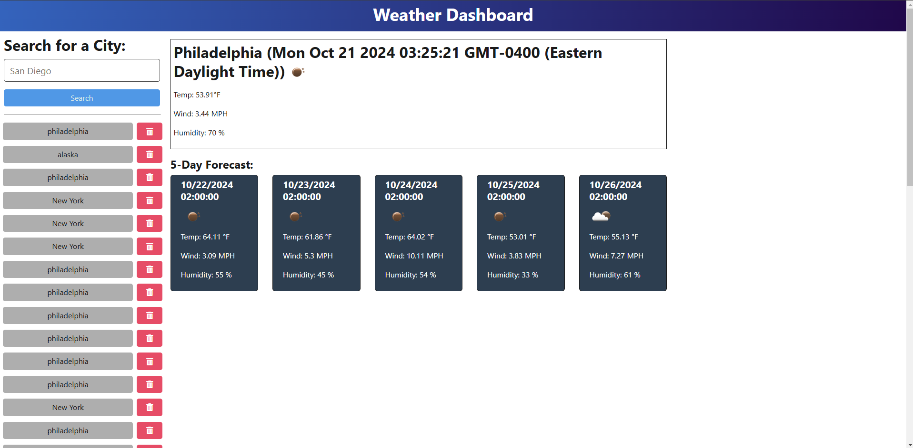

# K-Weather-Forecast

## Description
This application will give you the weather forecast of the current day and the next 5 days at 2:00:00 EDT when you search for a city. The history of the cities that have been searched will be saved and can be deleted as well if that is what you desire. The Weather forecast will include the temperature, wind speed, and humidity at 2AM in the city you search for.
## Table of Contents
* [Installation](#installation)
* [Usage](#usage)
* [Credits](#credits)
 * [License](#license)
* [Badges](#badges)
* [Features](#features)
* [How to Contribute](#howToContribute)

## Installation
The link to the deployed application will be here later. In order to get access to this application, you will need to follow the link.
## Usage
When you have access to the applicaiton, you can type the cities that you want to check the weather for. Once you hit search, it will give you the forecast for the current weather and the weather for the next 5 days at 2 AM EDT. Here is an example of how the application will look like after you search up a city. 

## Credits
N/A
## License
MIT 
## Badges
N/A
## Features
* Search history section with the ability to search for cities all around the world.
* Delete history options
* Access to API of the weather forecast for certain cities at 2 AM EDT for current day and the next 5 days.

## How to Contribute
You can reach out to me on the contact information below.

## Questions
Contact:
* Name: Kane Esasta
* Email: kaneesasta@gmail.com
* Github: [kaneganteng](https://github.com/kaneganteng)